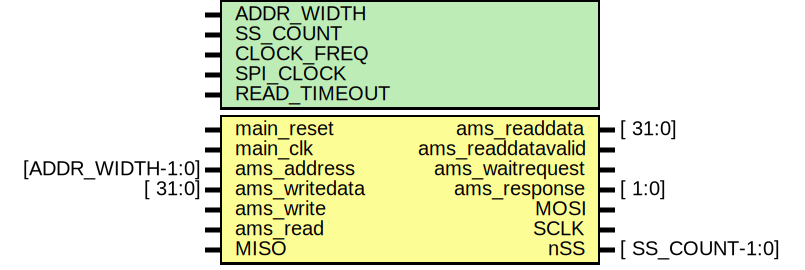
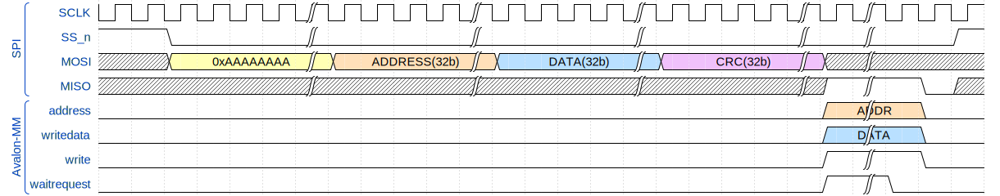

## Модуль



## Описание
 Временная диаграмма работы модуля



SS выбирается в старших разрядах адреса, например:

- ADDR_WIDTH - 12
- SS_COUNT - 2

Эффективная ширина адреса - 10 бит

### Использование

```c++
IOWR_32DIRECT(AMS_SPI_BASE, ( ( (SS) << (ADDR_WIDTH) ) | (ADDR) ) << 2, DATA);
```

- AMS_SPI_BASE - адрес устройства
- SS - выбранное устройство
- ADDR_WIDTH - ширина шины адреса
- ADDR- адрес записи данных
- DATA- данные для записи

## Параметры и порты

### Параметры

| Generic name |  Description |
| ------------ |  ----------- |
| ADDR_WIDTH   |        Ширина шины адреса           |
| SS_COUNT     |       Количество ведомых устройств |
| CLOCK_FREQ   |       Частота шины Avalon-MM |
| SPI_CLOCK    |       Частота SPI |
| READ_TIMEOUT |       Таймаут на операцию чтения |

### Порты

| Port name         | Direction | Type             | Description |
| ----------------- | --------- | ---------------- | ----------- |
| main_reset        | input     |                  | Основной сброс |
| main_clk          | input     |                  | Частота шины Avalon-MM|
| ams_address       | input     | [ADDR_WIDTH-1:0] | Адрес |
| ams_writedata     | input     | [          31:0] | Данные для записи |
| ams_readdata      | output    | [          31:0] | Считанные данные |
| ams_write         | input     |                  | Сигнал записи |
| ams_read          | input     |                  | Сигнал чтения |
| ams_readdatavalid | output    |                  | Сигнал корректности считанных данных |
| ams_waitrequest   | output    |                  | Сигнал ожидания |
| ams_response      | output    | [           1:0] | Сигнал ответа ведомого устройства |
| MOSI              | output    |                  | Master Output Slave Input |
| MISO              | input     |                  | Master Input Slave Output |
| SCLK              | output    |                  | Частота SPI |
| nSS               | output    | [  SS_COUNT-1:0] | Chip select |