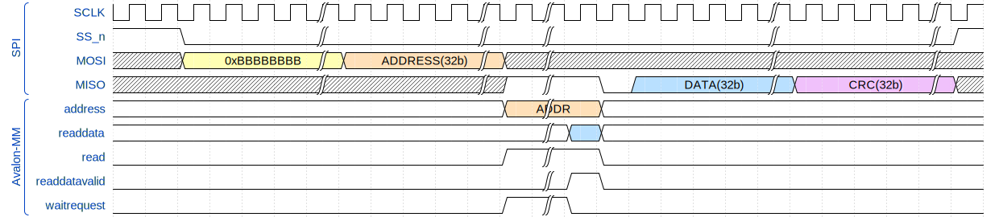

## Модуль

## Описание
 Временная диаграмма работы модуля

Ширина шины адреса выбирается автоматически 

### Параметры и порты

| Generic name   | Description        |
| -------------- | ------------------ |
| AMM_ADDR_WIDTH | Ширина шины адреса |
### Порты
| Port name         | Direction | Type                 | Description                          |
| ----------------- | --------- | -------------------- | ------------------------------------ |
| main_reset        | input     |                      | Основной сброс                       |
| main_clk          | input     |                      | Частота шины Avalon-MM               |
| amm_address       | output    | [AMM_ADDR_WIDTH-1:0] | Адрес                                |
| amm_writedata     | output    | [              31:0] | Данные для записи                    |
| amm_readdata      | input     | [              31:0] | Считанные данные                     |
| amm_write         | output    |                      | Сигнал записи                        |
| amm_read          | output    |                      | Сигнал чтения                        |
| amm_readdatavalid | input     |                      | Сигнал корректности считанных данных |
| amm_waitrequest   | input     |                      | Сигнал ожидания                      |
| MOSI              | input     |                      | Master Output Slave Input            |
| MISO              | output    |                      | Master Input Slave Output            |
| SCLK              | input     |                      | Частота SPI                          |
| nSS               | input     |                      | Chip select                          |
